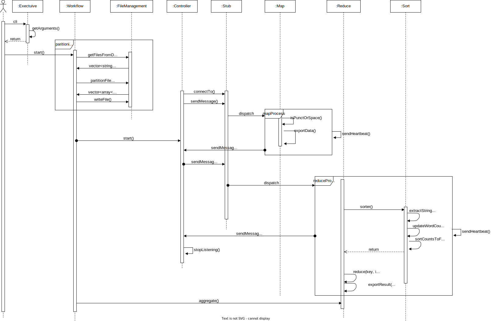

# ood_map_reduce

## Commands to Build Dynamic Link Library (Linux)
generates object file using source code<br />
g++ -std=c++17 -c -fPIC [source code(.cpp file)] -o [output object file(.o file)]
```console
g++ -std=c++17 -c -fPIC dll/ReduceDll.cpp -o reduceDLL.o
g++ -std=c++17 -c -fPIC dll/Map.cpp -o mapDLL.o
g++ -std=c++17 -c -fPIC src/FileManager.cpp -o FileManager.o
g++ -std=c++17 -c -fPIC src/Sort.cpp -o Sort.o
``` 

creates shared library using object files as input<br />
g++ -std=c++17 -shared [object file of source code(.o file)] -o [pick a name for shared library(.so file)]
```console
g++ -std=c++17 -shared reduceDLL.o FileManager.o Sort.o -o dll/linux/libReduce.so
g++ -std=c++17 -shared mapDLL.o FileManager.o Sort.o -o dll/linux/libMap.so
``` 

compiles main.cpp file. Outputs "main" executable<br />
g++ -std=c++17 main.cpp -ldl -pthread [source code(.cpp file) and header files(.h file)] -o main
```console
g++ -std=c++17 src/main.cpp -ldl -pthread src/Executive.cpp src/Workflow.cpp src/Sort.cpp src/FileManager.cpp src/headers/Executive.h src/headers/Workflow.h src/headers/Sort.h src/headers/FileManager.h -o main
``` 

## Commands to Build Dynamic Link Library (MAC/Windows)

```sh
g++ -std=c++17 -c -fPIC dll/ReduceDll.cpp -o libReduce.o
g++ -std=c++17 -c -fPIC src/FileManager.cpp -o FileManager.o
g++ -std=c++17 -c -fPIC dll/Map.cpp -o libMap.o

# mac
g++ -std=c++17 -shared -o libReduce.dylib libReduce.o FileManager.o
g++ -std=c++17 -shared -o libMap.dylib libMap.o FileManager.o

# windows
g++ -std=c++17 -shared -o libReduce.dll libReduce.o FileManager.o
g++ -std=c++17 -shared -o libMap.dll libMap.o FileManager.o

g++ -std=c++17 src/main.cpp src/Executive.cpp src/FileManager.cpp src/Sort.cpp src/Workflow.cpp -o main

./main --inputDir data/input --tempDir data/temp --outputDir data/output --reduceDLL dll/mac/libReduce.dylib --mapDLL dll/mac/libMap.dylib 

# TODO Run the program.
```

## Unit Testing
This command creates a build folder with generated Makefile. (You should have a CMakeList.txt file in the same directory you run this command)
```console
cmake -B build
``` 
This command generates the unit test executable by executing the Makefile
```console
cd build
make
```
## Sequence Diagram



## Development

The repo uses `pre-commit` for formatting (clang-format) and linting (cpplint). To enable pre-commit hooks:

```bash
#install pre-commit
pip install pre-commit

#alternatively you can use homebrew
brew install pre-commit

## install clang-format and cpplint
pip install clang-format

pip install cpplint

# install the git hook scripts
pre-commit install
```
